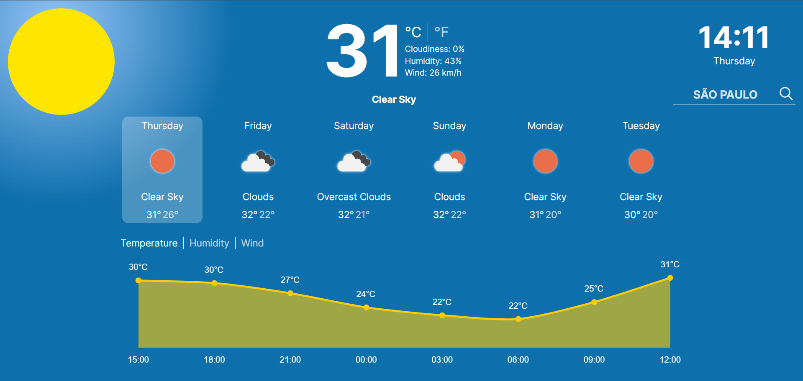
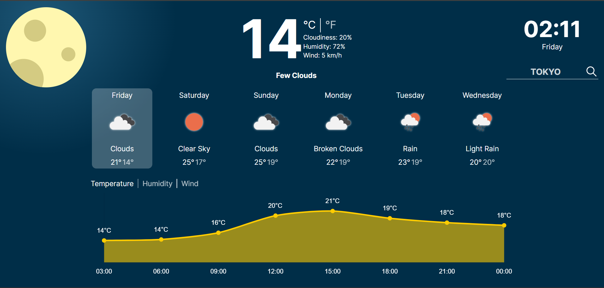

# Weather Forecast App

## Overview

This project aims to provide weather information and showcase development skills. It includes features like displaying current weather conditions, a 5-day forecast, interactive weather charts, and customizable units (°C/°F, km/h/mph).

## Key Features

- **Current Weather**: Displays temperature, cloudiness, humidity, and wind speed. Allows users to choose between Celsius and Fahrenheit.
- **5-Day Forecast**: Shows weather information for the current day and the next 5 days, including descriptions, icons, and min/max temperatures.
- **Location Search**: Enables users to search for weather information based on their desired location. The initial location is determined using the user's IP address or defaults to London if not detected.
- **Interactive Theme**: The theme changes dynamically based on the time of day, with a sun icon during the day and a moon icon at night.
- **Customizable Charts**: Users can select which weather data to view in charts, such as temperature for the next 24 hours, humidity, or wind direction/speed.

## Technologies Used

- React
- Chart.js
- JavaScript
- Node.js (for development)

## Getting Started

1. Clone the repository: `git clone https://github.com/seu-usuario/nome-do-repositorio.git`
2. Install dependencies: `npm install`
3. Replace `'your api key'` in `app.jsx` with your OpenWeatherMap API key.
4. Start the application: `npm start`

Note: You need an OpenWeatherMap API key. Sign up at [OpenWeatherMap](https://openweathermap.org/) to get your API key.

## Screenshots

